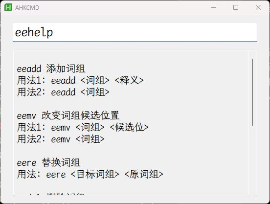

# rime 配置备份与分享

## 前言

- rime 由于官方文档写的太差, 所以配置起来很难, 实际很简单, 所以这里分享一下我的配置, 让后来的人少踩坑. 
- 只在 windows 平台上使用, 所以只分享 windows 平台的配置, 也就是小狼毫的配置.
- 本配置是**五笔**配置, 所以拼音用户可以参考, 五笔用户直接上手换词库就行.
- 由于词库有个人隐私信息, 所以五笔词库就不分享了. 再说五笔词库随人走, 相信你也有自己的词库

## 简要说明
### 自定义快捷键

所有的功能都在这

- <kbd>zhelp</kbd>                      查看所有快捷键，不用背了
- <kbd>Ctrl</kbd> + <kbd>Space</kbd>           中英文切换 （同微软五笔）
- <kbd>Ctrl</kbd> + <kbd>Shift</kbd> + <kbd>F4</kbd>   输入方案选择
- <kbd>Ctrl</kbd> + <kbd>Shift</kbd> + <kbd>F5</kbd>   最近两个方案来回切换
- <kbd>Ctrl</kbd> + <kbd>Shift</kbd> + <kbd>F6</kbd>   emoji 开关
- <kbd>Ctrl</kbd> + <kbd>Shift</kbd> + <kbd>F7</kbd>   切换到五笔方案
- <kbd>Ctrl</kbd> + <kbd> . </kbd>              中英标点符号切换 （同微软五笔）
- <kbd>Shift</kbd> + <kbd>Space</kbd>         半角全角切换 （同微软五笔）
- <kbd>Ctrl</kbd> + <kbd> \ </kbd>              简繁切换
- <kbd>Ctrl</kbd> + <kbd>Shift</kbd> + <kbd> | </kbd>  常用过滤，默认打开
- <kbd>Ctrl</kbd> + <kbd>Enter</kbd>           回车是清码
- <kbd>zv</kbd>                          数字大写 与 计算器
- <kbd>zu</kbd>                          Unicode 转换成汉字
- <kbd>zi</kbd>                          symbol 符号
- <kbd>zo</kbd>                          多行输出，在 lua 中配置
- `zhelp`                      显示帮助
- <kbd>time</kbd> <kbd>date</kbd> <kbd>dati</kbd> <kbd>week</kbd> <kbd>month</kbd>   输入时间
- <kbd>lunar</kbd>                       农历

### 中英文切换设定

通过 ahk v2 实现 <kbd>Ctrl</kbd> + <kbd>Space</kbd> 切换中英文并上屏编码

如果要使用, 需要额外下载 ahk v2, 并写下面代码, 最后设置开机运行 ahk 脚本, 如果不会, 那就不配.

```AHK
; Ctrl + Space  输出 RShift  用来对rime输入法的补充
^Space::
{
  KeyWait "Control"
  Send "{RShift}"
}
```

## 词库加词与删词

rime 加词与删词并不方便, 所以用 python 写了一个脚本, 加词与删词就很方便了. 补齐了 rime 唯一的短板.

但通用性很差, 当时写得很随意, 没想过兼容性, 所以需要自改脚本中的路径, 才能使用.(等我有空写的教程 #todo)

**脚本不能上手即用**

使用方法: 将脚本所在路径`aRimeScripts`加入到环境变量中, 安装 python，打开终端输入相应命令即可使用

- `eeadd 词` 添加词组
- `eedel 词` 删除词组
- `eemv 词` 改变词组顺序
- `eelua 单字` 添加屏蔽字
- `eere 新词 被替换词` 替换词库中的词

命令操作的是主词库与英文词库, 用户词库与符号需手动修改

### 图形化界面改词库

命令行加词虽然方便，但依然存在一些问题

- Windows 的终端打开速度慢
- 每次都要输入命令，麻烦

如何能像极点五笔，QQ五笔还有其它输入法一样按 `Ctrl` + `+` 就能迅速打开改词界面。还得是 ahk，简单高效。

如果你按照前面操作，只需将页末的代码加入到 ahk 即可。

用法：

- `Ctrl` + `Alt` + `+` 打开 ahk 窗口，已经预输入 eeadd

- `Ctrl` + `D` 快速输入 eedel
- `Ctrl` + `M` 快速输入 eemv

- `Ctrl` + `H` 快速查看帮助
- 默认回车运行命令，Esc 关闭窗口，或者切后台thf



```ahk
;## Ctrl + Alt + = 简易 cmd 命令输入器, 主要用来 rime 词库的更改
^!=::
{
  myTitle := "AHKCMD"
  AHKCMDGUI := Gui("+Resize", myTitle) ; ToolWindow不要标题栏, +Owner不显示任务栏icon, 会报错不能美观

  AHKCMDGUI.OnEvent("Close", ExitAHKCMD)

  AHKCMDGUI.SetFont("s20", "霞鹜文楷等宽")
  cmdInput := AHKCMDGUI.Add("Edit", "w500 vCommand", "eeadd ")
  AHKCMDGUI.SetFont("s16", "Maple")
  resultArea := AHKCMDGUI.Add("Edit", "w500 h300 ReadOnly")

  AHKCMDGUI.Show()

  Sleep 50
  Send "{Right}"

  Hotkey "Esc", ExitAHKCMD, "On"
  Hotkey "Enter", ExecuteCommand, "On"
  Hotkey "^m", eemv, "On"
  Hotkey "^r", eere, "On"
  Hotkey "^d", eedel, "On"
  Hotkey "^l", eelua, "On"
  hotkey "^h", eehelp, "On"
  hotkey "^p", eedep, "On"
  hotkey "^s", eesync, "On"

  eemv(*) {
    cmdInput.Value := "eemv "
    send "{End}"
  }
  eere(*) {
    cmdInput.Value := "eere "
    send "{End}"
  }
  eedel(*) {
    cmdInput.Value := "eedel "
    send "{End}"
  }
  eelua(*) {
    cmdInput.Value := "eelua " 
    send "{End}"
  }
  eehelp(*) {
    cmdInput.Value := "eehelp"
    send "{End}"
    ExecuteCommand()
  }
  eedep(*) {
    cmdInput.Value := "eedep"
    send "{End}"
    ExecuteCommand()
  }
  eesync(*) {
    cmdInput.Value := "eesync"
    send "{End}"
    ExecuteCommand()
    ; resultArea.Focus()
  }

  ExitAHKCMD(*) {
    Hotkey "Esc", ExitAHKCMD, "Off"
    Hotkey "Enter", ExecuteCommand, "Off"
    Hotkey "^m", eemv, "Off"
    Hotkey "^r", eere, "Off"
    Hotkey "^d", eedel, "Off"
    Hotkey "^l", eelua, "Off"
    Hotkey "^h", eehelp, "Off"
    Hotkey "^p", eedep, "Off"
    Hotkey "^s", eesync, "Off"
    SetTimer TimerExitGUI.Bind(myTitle), 0
    if (AHKCMDGUI) {
      AHKCMDGUI.Destroy()
    }
  }

  SetTimer TimerExitGUI.Bind(myTitle), 1000

  TimerExitGUI(myTitle) {
    if !WinActive(myTitle) {
      ExitAHKCMD()
    }
  }

  ExecuteCommand(*) {
    try {
      command := cmdInput.Value
      if (command = "") {
        resultArea.Value := "错误：请输入命令"
        return
      }

      ; shell := ComObject("WScript.Shell")
      ; exec := shell.Exec("dir")
      ; result := exec.StdOut.ReadAll()

      tmpClip := A_Clipboard
      A_Clipboard := ""
      RunWait A_ComSpec " /C " command " | Clip", , "Min"
      result := A_Clipboard

      if (result = "") {
        ; result := exec.StdErr.ReadAll()
        result := A_Clipboard
        if (result = "") {
          result := "命令执行成功，但无输出内容"
        } else {
          result := "错误: `n" result
        }
      }
      resultArea.Value := result
      A_Clipboard := tmpClip
    } catch Error as e {
      resultArea.Value := "执行失败: `n" e.Message
    }
  }
}
```

 

